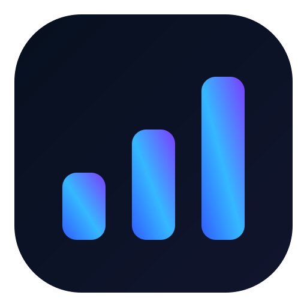

# 📊 SquareScope

### Open-source business intelligence for Square merchants

**Turn your Square data into real business insights.**

---

## 👋 Meet SquareScope

SquareScope is a free and open-source analytics dashboard for businesses using Square.

Instead of digging through exports and disconnected reports, SquareScope turns your Square data into a clean business intelligence dashboard covering:

- 💰 Sales analytics
- 👥 Customer insights
- 🛍️ Products & services
- 📅 Bookings & appointments
- 🔁 Customer retention
- 📈 Business trends
- 🔮 Forward-looking insights

Your Square credentials stay inside your own deployment.

---

## 🏪 Built for Square businesses

SquareScope is intentionally industry-neutral.

It can be used or adapted for:

- ☕ Cafés & restaurants
- 🛍️ Retail
- ✂️ Salons & barbers
- 🏋️ Fitness businesses
- 🎨 Studios
- 💼 Consultants
- 🔧 Trades & service businesses
- 📅 Appointment-based businesses

If your business runs through Square, SquareScope aims to help you understand the data behind it.

---

## ✨ What's inside?

### 📊 Overview

A high-level view of sales, transactions, customers and business performance.

### 💰 Sales

Analyse completed Square sales, refunds, average transaction value, payment methods, monthly trends and year-to-date performance.

### 👥 Customers

Explore customer activity, repeat customers, lifetime value and engagement.

### 🛍️ Products & Services

Understand which catalog items, products and services contribute to sales.

### 📅 Bookings

Where Square Bookings data is available, SquareScope can surface upcoming appointments, booked hours and forward booked value.

### 💡 Insights

Turn multiple Square datasets into business-friendly observations instead of displaying raw API responses.

---

## 🧱 Tech stack

| Technology | Purpose |
|---|---|
| ⚡ Next.js | Application framework |
| ⚛️ React | UI |
| 🔷 TypeScript | Type-safe application code |
| 🎨 Tailwind CSS | Styling |
| 📈 Recharts | Data visualisation |
| ⬛ Square APIs | Business data |
| ▲ Vercel | Optional deployment |

---

## 🚀 Getting started

### 1. Clone SquareScope

    git clone https://github.com/BillySmithDesign/SquareScope.git
    cd SquareScope

### 2. Install dependencies

    npm install

### 3. Create your environment file

    cp .env.example .env.local

Then edit `.env.local`:

    SQUARE_ACCESS_TOKEN=YOUR_SQUARE_ACCESS_TOKEN
    SQUARE_LOCATION_ID=YOUR_SQUARE_LOCATION_ID
    SQUARE_ENVIRONMENT=sandbox

    BUSINESS_TIMEZONE=UTC
    BUSINESS_LOCALE=en-US
    BUSINESS_CURRENCY=USD

    NEXT_PUBLIC_BUSINESS_TIMEZONE=UTC
    NEXT_PUBLIC_BUSINESS_LOCALE=en-US
    NEXT_PUBLIC_BUSINESS_CURRENCY=USD

Never commit `.env.local`.

---

## ⬛ Connect your Square account

You'll need credentials for the Square account you want SquareScope to analyse.

Create or select an application in the Square Developer Dashboard:

https://developer.squareup.com/apps

SquareScope currently expects:

| Variable | Purpose |
|---|---|
| `SQUARE_ACCESS_TOKEN` | Server-side credential used to access Square APIs |
| `SQUARE_LOCATION_ID` | Square location to analyse |
| `SQUARE_ENVIRONMENT` | Square API environment: `sandbox` or `production` |
| `BUSINESS_TIMEZONE` | Server-side business timezone |
| `BUSINESS_LOCALE` | Server-side formatting locale |
| `BUSINESS_CURRENCY` | Business currency code |
| `NEXT_PUBLIC_BUSINESS_TIMEZONE` | Dashboard display timezone |
| `NEXT_PUBLIC_BUSINESS_LOCALE` | Dashboard display locale |
| `NEXT_PUBLIC_BUSINESS_CURRENCY` | Dashboard display currency |

### 🌍 Environment and regional settings

SquareScope defaults to the Square sandbox environment. Use `SQUARE_ENVIRONMENT=sandbox` for development and testing. Set `SQUARE_ENVIRONMENT=production` only when you are ready to connect real merchant data.

SquareScope does not assume a country, currency or timezone. Configure the `BUSINESS_` and `NEXT_PUBLIC_BUSINESS_` variables for your merchant. For example, an Australian business could use `Australia/Adelaide`, `en-AU` and `AUD`.

The `NEXT_PUBLIC_` settings contain display configuration only and are intentionally browser-visible. Never place a Square access token in a `NEXT_PUBLIC_` variable. On Vercel, set these variables before building or deploying because Next.js includes public environment values in the client bundle at build time.

### 🔐 Keep your token private

Your Square access token is sensitive.

Never:

- expose it using a `NEXT_PUBLIC_` variable
- commit `.env.local`
- put it in frontend JavaScript
- publish it in screenshots
- paste it into a GitHub issue

For hosted deployments, use your hosting provider's encrypted environment-variable system.

---

## 🧪 Run locally

    npm run dev

Then open:

    http://localhost:3000

---

## 🏗️ Production build

    npm run build
    npm start

---

## ▲ Deploy to Vercel

SquareScope is designed to work with Vercel.

1. Fork or clone this repository.
2. Import it into Vercel.
3. Add all environment variables documented above.
4. Start with `SQUARE_ENVIRONMENT=sandbox` while testing.
5. Deploy and verify the dashboard.
6. Enable authentication or Vercel Deployment Protection.
7. Only then switch to `SQUARE_ENVIRONMENT=production` and add production Square credentials.

> ⚠️ A SquareScope deployment containing customer or financial data should not be left publicly accessible.

---

## 🔒 Privacy & security

SquareScope is a self-hosted/open-source business intelligence application.

Before using real production data:

- 🔐 enable authentication or deployment protection
- 🔑 keep Square credentials server-side
- 🌐 use HTTPS
- 👤 restrict repository and environment access
- 📝 inspect logs before sharing them
- ♻️ rotate credentials immediately if they're exposed

The application dashboard should be treated as private business software rather than a public website.

---

## 🗂️ Analytics API

SquareScope's analytics layer lives under:

    /api/analytics/

Current workspaces include:

    overview
    revenue
    customers
    products & services
    bookings
    insights

Available information depends on which Square products your merchant account uses.

---

## 🛣️ Roadmap

- [ ] Multi-location support
- [ ] Square OAuth onboarding
- [ ] Configurable dashboard modules
- [ ] Custom date ranges
- [ ] CSV/PDF reporting
- [ ] Enhanced catalog analytics
- [ ] Enhanced booking analytics
- [ ] Docker deployment
- [ ] Built-in authentication options
- [ ] Improved mobile experience
- [ ] Community insight modules
- [ ] Easier first-run configuration

---

## 🤝 Contributing

Contributions are welcome.

You can help by:

- 🐛 reporting bugs
- 💡 suggesting features
- 🧑‍💻 submitting pull requests
- 📝 improving documentation
- 🎨 improving UI/UX
- 🧪 testing different Square business configurations

Please **never include real customer data or Square credentials** in an issue or pull request.

See `CONTRIBUTING.md` for more information.

---

## 🧪 We need different Square businesses

Square accounts vary considerably depending on the products a merchant uses.

Testing and feedback is especially useful from businesses using:

- Square POS
- Square Online
- Square Bookings
- Restaurants
- Retail
- Professional services
- Multi-location Square accounts

---

## ⚖️ Independent project

**SquareScope is an independent open-source project.**

It is not affiliated with, endorsed by, sponsored by, or officially supported by Block, Inc. or Square.

Square and related marks are trademarks of their respective owners.

Use of Square APIs remains subject to Square's developer terms and policies.

---

## 📄 License

SquareScope is released under the **MIT License**.

You can use it, modify it, fork it and build on it subject to the terms of the license.

---

## 📊 Better data. Better decisions.

### SquareScope

Built for the Square community. 💙

**⭐ If SquareScope helps you, give the project a star.**

